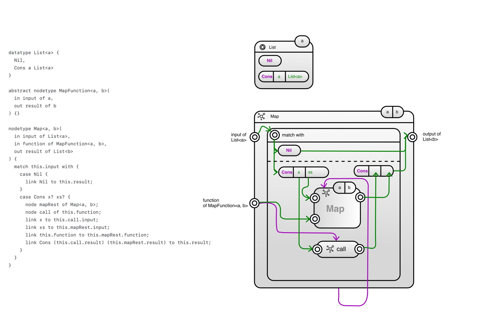

# 🌈 Bifrost language

Is a domain-specific language for functional programming described through a graph structure.

This project in this moment is a finger practice. In German it is called `Fingerübung` ✌. It is for training purpose and for finding opportunities to improve the tooling around [Langium](https://langium.org/).

The syntax is inspired by Haskell.

The name `Bifrost` comes from the Norse mythology, where the term was the name of a bridge between Midgard (Earth) and Asgard, the realm of the gods.

## > features list

* [x] custom (generic) data types
* [x] primitive types like  `Integer`, `Float`, `String` and `Boolean`
* [x] node types (made of sub `nodes` and `links`, basically what you can understand as a function)
* [ ] classes, instances, type constraints (Haskell way)
* [ ] visuals generator 
* [ ] WebAssembly generator 

## > lotes status

It is a reoccurring problem for me: How to program the best without many keyboard interactions.

Currently, you can model [Fibonacci](examples/fibonacci.beef) and a [generic Map function](examples/map.beef).

Look at this implementation of `map` and how it could look as graph diagram:

Things in my head are:

* further validations
* Haskell classes and instances (type constraints)
* Monads
* Prelude nodes
* generators for
  * creating initial layout
  * creating a web assembly
* a mobile app for the graphical counter part

## > license

[MIT](LICENSE.md)
